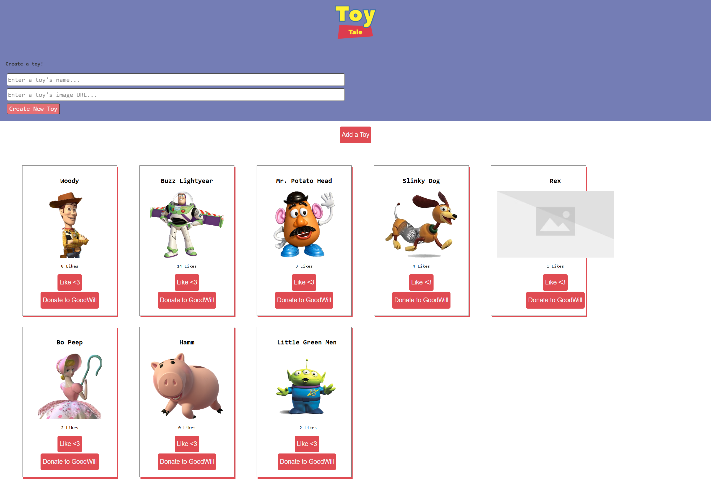

# Toy Tales

Toy Tales is a simple React application that allows users to manage a collection of toys. Users can view a list of toys, add new toys to the collection, "like" toys to increase their popularity, and "donate" toys to remove them from the collection.

## Demo



## Features

- **View Toys**: Fetches and displays a collection of toys from a local API.
- **Add a Toy**: A controlled form to add a new toy with a name and image URL.
- **Like a Toy**: Increase the number of likes for a specific toy via a PATCH request.
- **Donate a Toy**: Remove a toy from the collection and the database via a DELETE request.
- **Toggle Form**: Show or hide the toy creation form with a button click.

## Technologies Used

- **React**: For building the user interface and managing state.
- **Vite**: As the build tool and development server.
- **JSON Server**: To provide a RESTful API using a `db.json` file.
- **CSS**: Custom styling for a "Toy Story" inspired look and feel.
- **Vitest & React Testing Library**: For unit testing components.

## Getting Started

### Installation

1. Clone the repository:
   ```bash
   git clone git@github.com:yeswadams/react-hooks-toy-tales-vite.git
   ```
2. Navigate to the project directory:
   ```bash
   cd react-hooks-toy-tales-vite
   ```
3. Install dependencies:
   ```bash
   npm install
   ```

### Running the Application

1. Start the JSON Server (API):
   ```bash
   npm run server
   ```
   The server will run at `http://localhost:3001`.

2. In a new terminal tab, start the React development server:
   ```bash
   npm run dev
   ```
   The application will be available at `http://localhost:5173` (or the port specified by Vite).

### Running Tests

To run the test suite, use the following command:
```bash
npm run test
```

## Project Structure

- `src/components/App.jsx`: Main application component managing state and layout.
- `src/components/ToyForm.jsx`: Component for the new toy creation form.
- `src/components/ToyContainer.jsx`: Wrapper for the list of toy cards.
- `src/components/ToyCard.jsx`: Individual card displaying toy details and actions.
- `db.json`: Local database file for JSON Server.
